<div align="center">

# 🔍 Mini Search Engine with RAG Extension

**AI356 — Information Retrieval · Spring 2025-2026**  
**Jordan University of Science and Technology**

[](https://python.org)
[](https://nltk.org)
[](https://scipy.org)
[](https://deepmind.google/gemini)
[](/)
[](/)
[](/)

<br/>

> A complete **Information Retrieval system** built on the **Vector Space Model** with **TF-IDF weighting** and **cosine similarity ranking**, evaluated on the Cranfield benchmark, and extended with a **Retrieval-Augmented Generation (RAG)** pipeline powered by Google Gemini 2.5 Flash.

</div>

---

## 📋 Table of Contents

- [Overview](#-overview)
- [Evaluation Results](#-evaluation-results)
- [Pipeline Architecture](#-pipeline-architecture)
- [Data Flow](#-data-flow)
- [Project Structure](#-project-structure)
- [Quick Start](#-quick-start)
- [Phase Details](#-phase-details)
- [TF-IDF Formula Breakdown](#-tf-idf-formula-breakdown)
- [Sample Retrieval Results](#-sample-retrieval-results)
- [RAG Answers](#-rag-answers)
- [Dataset](#-dataset-cranfield-collection)
- [Dependencies](#-dependencies)
- [CLI Reference](#-cli-reference)

---

## 🧭 Overview

This project implements a full IR pipeline in two parts:


| Part | Description |
|------|-------------|
| **Part 1 — Classical IR** | Vector Space Model · TF-IDF · Cosine similarity · Inverted index |
| **Part 2 — RAG Extension** | Top-5 retrieved docs → Gemini 2.5 Flash → Cited natural-language answer |

---

## 📊 Evaluation Results

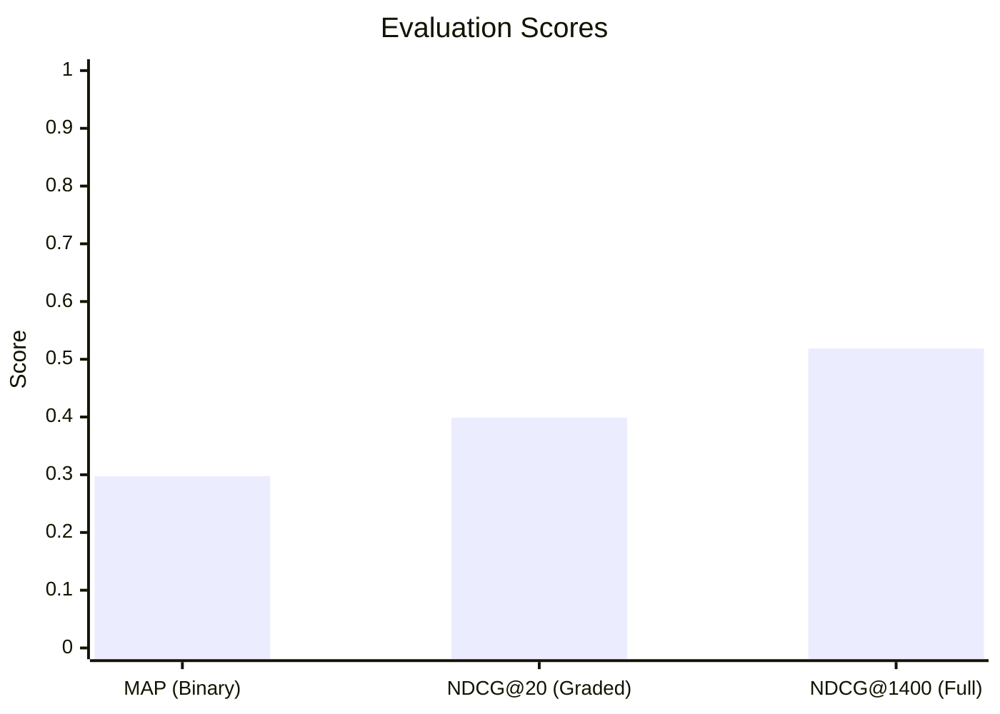

| Metric | Score | Description |
|--------|:-----:|-------------|
| **MAP** | **`0.2976`** | Mean Average Precision — binary relevance (scores 1–4 = relevant) |
| **NDCG@20** | **`0.3988`** | Normalized DCG at rank 20 — graded relevance |
| **NDCG@1400** | **`0.5186`** | Normalized DCG — full 1,400-document ranking |

### Per-Query Performance

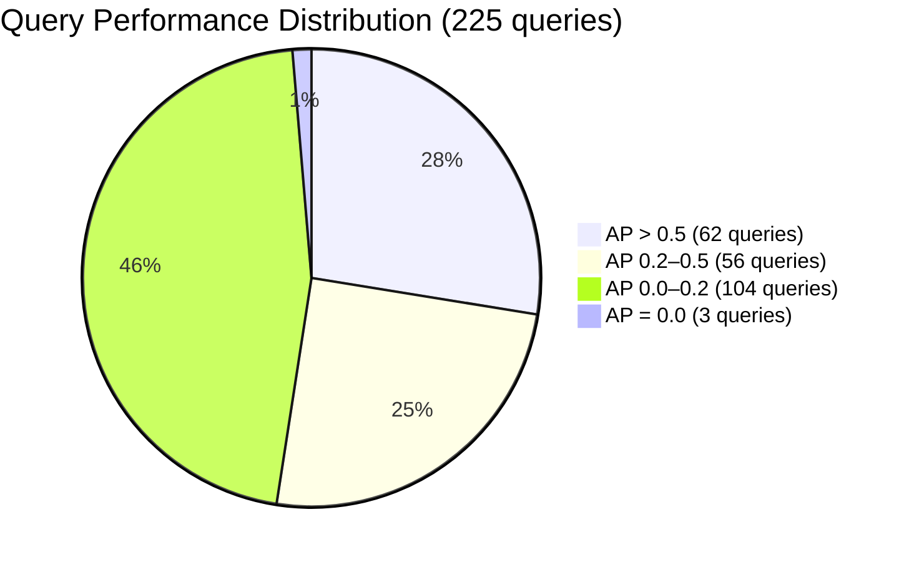

| 🏆 Best Queries | AP | 💔 Worst Queries | AP |
|----------------|:--:|-----------------|:--:|
| Query 9 | `1.0000` — Perfect | Query 13 | `0.0000` |
| Query 119 | `1.0000` — Perfect | Query 22 | `0.0000` |
| Query 172 | `0.8542` | Query 44 | `0.0000` |
| Query 3 | `0.6592` | Query 31 | `0.0010` |
| Query 52 | `0.8125` | Query 216 | `0.0020` |

---

## 🏗️ Pipeline Architecture

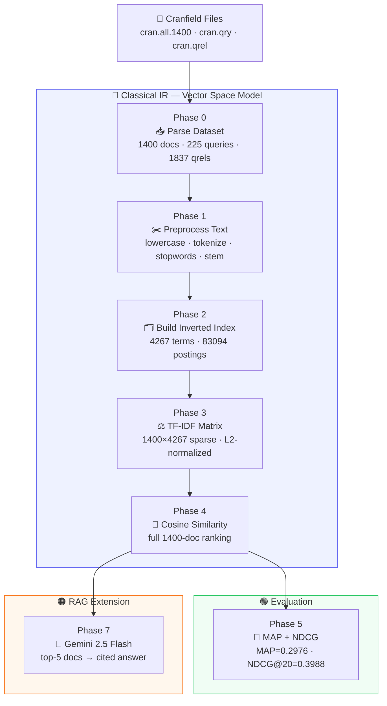

---

## 🔄 Data Flow

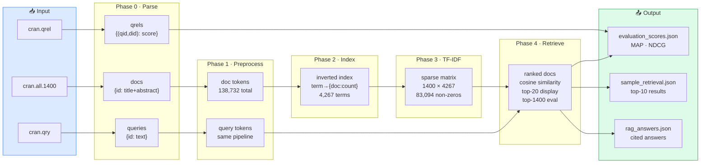

---

## 📁 Project Structure

```
ir_project/
│
├── 📂 data/                          # Cranfield dataset files
│   ├── cran.all.1400                 # 1,400 aerospace documents
│   ├── cran.qry                      # 225 user queries
│   ├── cran.qrel                     # 1,837 relevance judgments
│   └── cranqrel.readme               # Relevance scale documentation
│
├── 📂 results/                       # Auto-generated on run
│   ├── evaluation_scores.json        # MAP, NDCG@20, per-query scores
│   ├── sample_retrieval.json         # Top-10 docs for sample queries
│   └── rag_answers.json              # AI-generated answers + context
│
├── 🐍 phase0_parser.py               # Dataset parsing (docs, queries, qrels)
├── 🐍 phase1_preprocessor.py         # Text preprocessing pipeline
├── 🐍 phase2_index.py                # Inverted index construction
├── 🐍 phase3_4_tfidf_retrieval.py    # TF-IDF matrix + cosine similarity
├── 🐍 phase5_evaluation.py           # MAP and NDCG evaluation
├── 🐍 phase7_rag.py                  # RAG with Google Gemini
├── 🐍 main.py                        # Main pipeline orchestrator
├── 📄 requirements.txt               # Python dependencies
└── 📖 README.md                      # This file
```

---

## ⚡ Quick Start

### Prerequisites

- Python 3.10+
- The four Cranfield data files in `data/`
- A Google Gemini API key *(only for Phase 7 RAG)*

### Setup

```bash
# 1. Clone the repository
git clone https://github.com/your-username/ir-search-engine.git
cd ir-search-engine

# 2. Create virtual environment
python -m venv venv

# Windows
venv\Scripts\activate
# macOS / Linux
source venv/bin/activate

# 3. Install dependencies
pip install -r requirements.txt

# 4. Set Gemini API key (only needed for RAG)
# Windows PowerShell
$env:GEMINI_API_KEY = "AIza..."
# macOS / Linux
export GEMINI_API_KEY="AIza..."
```

### Run

```bash
# Full pipeline — IR + evaluation + RAG
python main.py

# IR + evaluation only — no API key needed
python main.py --no-rag

# Custom options
python main.py --k 20 --rag-queries 1 2 3 5 10 --rag-top-k 5

# Test individual phases
python phase0_parser.py
python phase5_evaluation.py
```

### Expected Terminal Output

```
============================================================
  Phase 0 — Parsing Cranfield Dataset
============================================================
[Phase 0] Parsed 1400 documents.
[Phase 0] Parsed 225 queries.
[Phase 0] Parsed 1,837 relevance judgments (0 lines skipped).

============================================================
  Phase 3 — Computing TF-IDF Matrix
============================================================
[Phase 3] Building TF-IDF matrix (1400 docs × 4267 terms)...
[Phase 3] TF-IDF matrix built and L2-normalized | Non-zeros: 83,094

==================================================
  EVALUATION RESULTS (top-1400)
==================================================
  MAP  (binary relevance) : 0.2976
  NDCG@20 (graded relev.) : 0.3988
==================================================

  Total runtime : 43.4s
```

---

## 🔬 Phase Details

### Phase 0 — Dataset Parsing

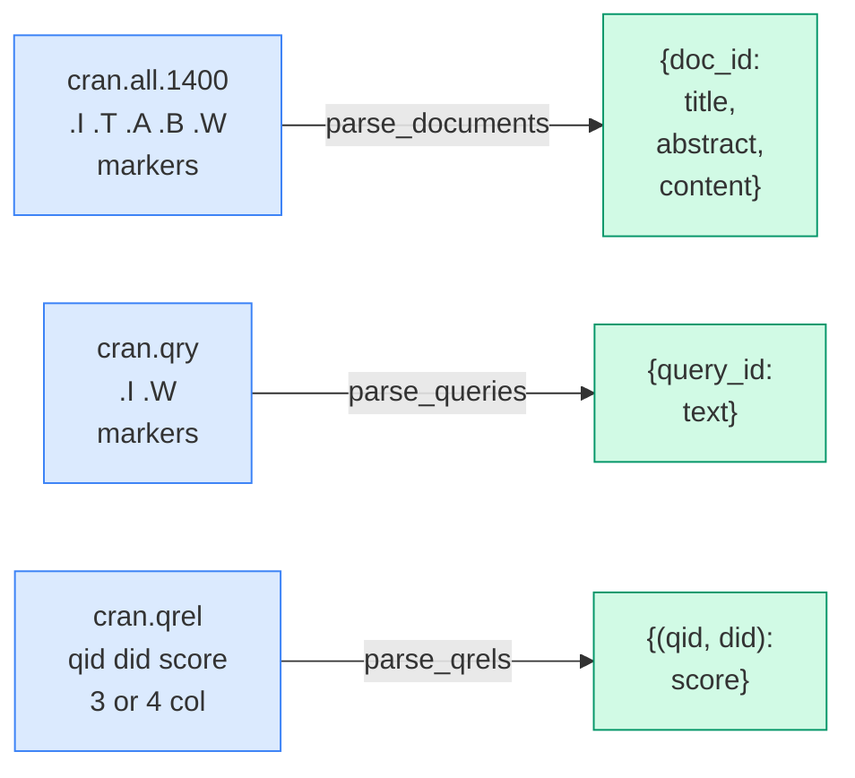

**Relevance scale (reversed — 1 = highest relevance):**

| Score | Meaning | Binary MAP | Graded NDCG Gain |
|:-----:|---------|:----------:|:----------------:|
| `1` | Most relevant | ✅ relevant | `4` |
| `2` | Relevant | ✅ relevant | `3` |
| `3` | Marginally relevant | ✅ relevant | `2` |
| `4` | Marginally irrelevant | ✅ relevant | `1` |
| `-1` | Irrelevant | ❌ not relevant | `0` |
| `—` | Not judged | ❌ not relevant | `0` |

> ⚠️ The Cranfield scale is **reversed** — score `1` is the **best** relevance, not the worst.

---

### Phase 1 — Text Preprocessing

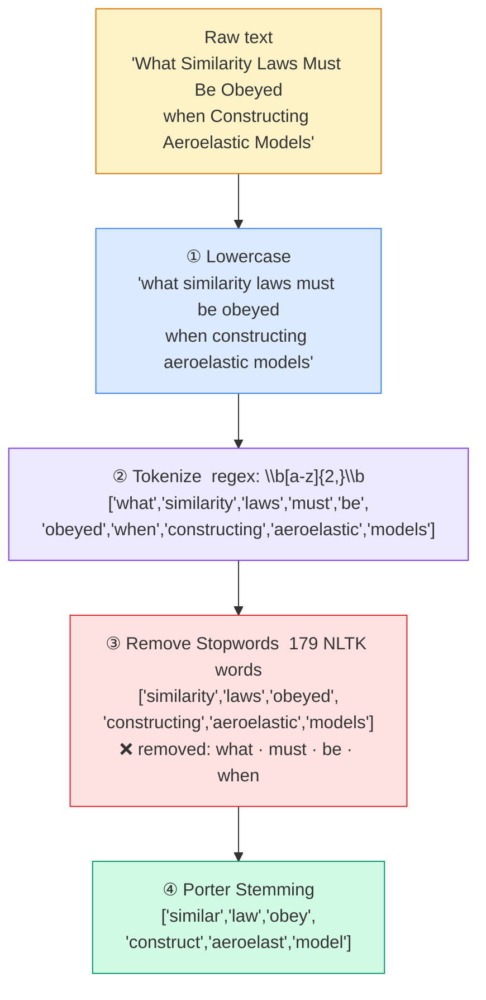

> 🔑 The **exact same pipeline** is applied to both documents and queries. If you stem documents but not queries, no terms will ever match.

**Statistics:**

| Metric | Value |
|--------|------:|
| Total tokens after preprocessing | `138,732` |
| Average tokens per document | `99.1` |
| Vocabulary size (unique stems) | `4,267` |

---

### Phase 2 — Inverted Index

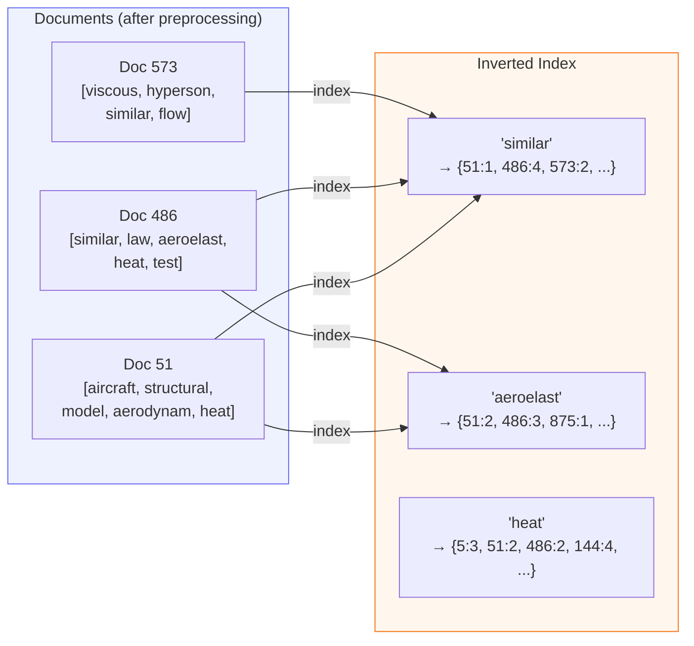

**Top terms by document frequency:**

| Rank | Term | Documents | % Corpus | IDF Weight |
|:----:|------|:---------:|:--------:|:----------:|
| 1 | `flow` | 730 | 52.1% | `0.283` — very low |
| 2 | `result` | 691 | 49.4% | `0.307` — very low |
| 3 | `aerodynam` | ~120 | 8.6% | `1.067` — medium |
| 4 | `aeroelast` | ~35 | 2.5% | `1.602` — high |
| 5 | `similar` | ~15 | 1.1% | `1.970` — very high |

---

### Phase 3 — TF-IDF Weighting

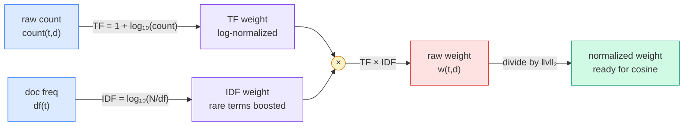

**Worked example — "aeroelast" in Doc 486:**

```
count  =  4 occurrences in Doc 486
df     =  35 documents contain "aeroelast"
N      =  1400 documents total

TF     =  1 + log₁₀(4)        =  1 + 0.602  =  1.602
IDF    =  log₁₀(1400 / 35)    =  log₁₀(40)  =  1.602
w      =  1.602 × 1.602        =  2.566   ← high — rare, informative term
```

**Matrix statistics:**

| Property | Value |
|----------|------:|
| Shape | `1400 × 4267` |
| Total cells | `5,973,800` |
| Non-zero cells | `83,094` |
| Sparsity | `98.6%` empty |
| Storage format | SciPy CSR sparse |

---

### Phase 4 — Cosine Similarity Retrieval

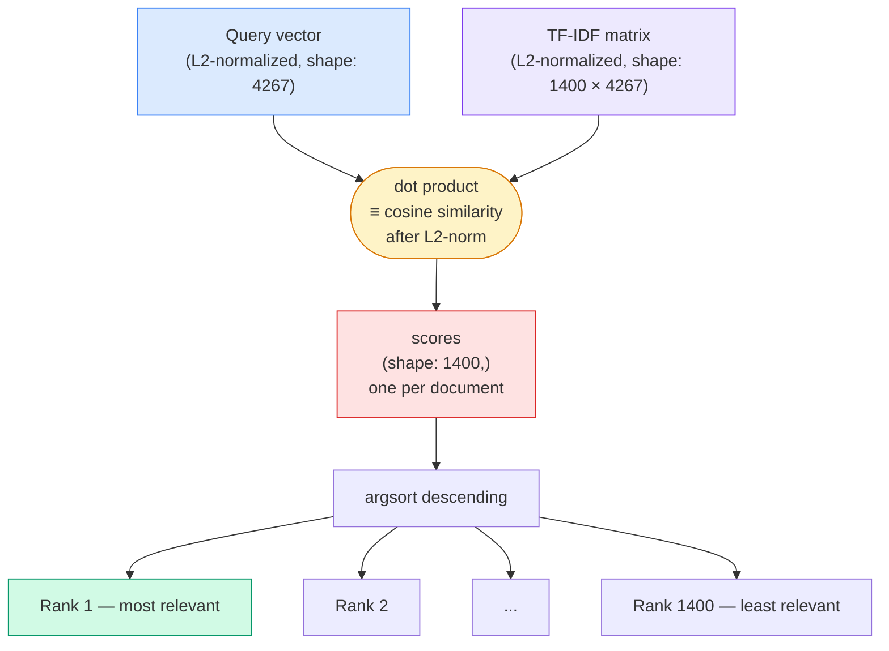

> ⚠️ **Critical design decision:** Evaluation uses `k = 1400` (all documents ranked).  
> Using `k = 20` caused MAP to drop from **0.2976 → 0.003** (100× lower) because MAP divides by the total number of relevant documents — and cutting off at rank 20 means missing most of them.

---

### Phase 5 — MAP & NDCG Evaluation

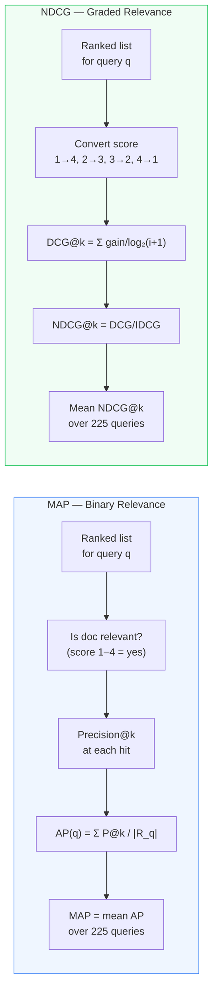

---

### Phase 7 — RAG Answer Generation

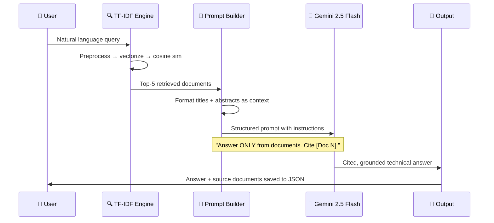

---

## ⚗️ TF-IDF Formula Breakdown

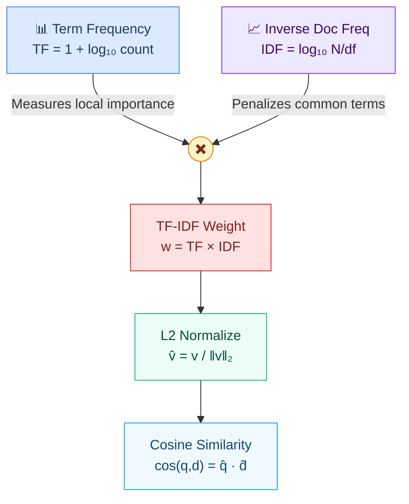

| Component | Formula | Why this formula |
|-----------|---------|-----------------|
| **TF** | `1 + log₁₀(count)` | Log compresses scale — 100 occurrences isn't 100× more important than 1 |
| **IDF** | `log₁₀(N / df)` | Rare terms get high weight; terms in every doc get near-zero weight |
| **TF-IDF** | `TF × IDF` | Local importance × global rarity = discriminative feature |
| **L2 Norm** | `v / ‖v‖₂` | Removes document length bias; enables cosine via dot product |

---

## 📄 Sample Retrieval Results

### Query 1 — Aeroelastic Similarity Laws

> *"What similarity laws must be obeyed when constructing aeroelastic models of heated high speed aircraft?"*

| Rank | Doc | Score | Title |
|:----:|:---:|:-----:|-------|
| 🥇 1 | 51 | `0.253` | Theory of aircraft structural models subjected to aerodynamic heating and external loads |
| 🥈 2 | 878 | `0.212` | Experimental model techniques and equipment for flutter investigations |
| 🥉 3 | 486 | `0.211` | Similarity laws for aerothermoelastic testing |
| 4 | 573 | `0.205` | Viscous hypersonic similitude |
| 5 | 12 | `0.195` | Some structural and aeroelastic considerations of high speed flight |

---

### Query 3 — Heat Conduction in Composite Slabs *(AP = 0.659)*

> *"What problems of heat conduction in composite slabs have been solved so far?"*

| Rank | Doc | Score | Title |
|:----:|:---:|:-----:|-------|
| 🥇 1 | 485 | `0.478` | Linear heat flow in a composite slab |
| 🥈 2 | 399 | `0.392` | Conduction of heat in composite slabs |
| 🥉 3 | 5 | `0.370` | One-dimensional transient heat conduction into a double-layer slab |
| 4 | 144 | `0.295` | Heat flow in composite slabs |
| 5 | 181 | `0.259` | Some problems on heat conduction in stratiform bodies |

---

### Query 10 — Real-Gas Transport Properties *(AP = 0.250)*

> *"Are real-gas transport properties for air available over a wide range of enthalpies and densities?"*

| Rank | Doc | Score | Title |
|:----:|:---:|:-----:|-------|
| 🥇 1 | 302 | `0.269` | Approximations for the thermodynamic and transport properties of high temperature air |
| 🥈 2 | 493 | `0.248` | Real-gas laminar boundary layer skin friction and heat transfer |
| 🥉 3 | 1143 | `0.233` | A one-foot hypervelocity shock tunnel with high-enthalpy real gas flows |
| 4 | 524 | `0.219` | Stagnation point heat transfer in partially ionized air |
| 5 | 949 | `0.214` | Charts for equilibrium flow properties of air in hyper-velocity nozzles |

---

## 🤖 RAG Answers

### Query 1 — Similarity Laws

> **When constructing aeroelastic models of heated high-speed aircraft, the following similarity laws must be obeyed:**
>
> 1. **Derivation Basis** — Similarity laws are obtained by nondimensionalizing the governing equations for aerodynamic flow, internal heat conduction, and structural stress-deflection **[Doc 3]**.
> 2. **Material and Thermal Similarity** — If constructed from the same materials and at the same temperature, the model will be thermally similar with respect to heat flow and external loads **[Doc 1]**.
> 3. **Challenges with Scale Ratio** — Achieving full similitude is very difficult when scale ratio is other than unity due to conflicts between Mach number, Reynolds number, aeroelastic parameter, and thermal parameters **[Doc 3]**.
> 4. **Mitigation Strategies** — Methods include incomplete aerothermoelastic testing and restricted-purpose models for specific phenomena **[Doc 3]**.

### Query 3 — Heat Conduction

> **Solved problems in heat conduction in composite slabs include:**
>
> - **Linear heat flow** — determining temperature as a function of position and time where external surface temperatures are prescribed functions **[Doc 1]**
> - **Total heat quantity** — method incorporating surface resistance as an additional layer **[Doc 2]**
> - **One-dimensional transient conduction** — analytic solutions for double-layer slabs with triangular heat input **[Doc 3]**
> - **Rocket engine composite walls** — Fourier series solutions for refractory + metallic media under uncooled rocket conditions **[Doc 4]**

### Query 10 — Real-Gas Properties

> **Yes, real-gas transport properties for air are available over a wide range:**
>
> - Viscosity and thermal conductivity tabulated from **500K to 15,000K** at pressures **0.0001–100 atm** **[Doc 1]**
> - Transport properties for partially ionized air at **25,000–40,000 ft/sec** **[Doc 4]**
> - Charts for equilibrium flow up to **10,000 btu/lb** enthalpy and **1,000 atm** stagnation pressure **[Doc 5]**

---

## 📦 Dataset — Cranfield Collection

The [Cranfield collection](http://ir.dcs.gla.ac.uk/resources/test_collections/cran/) is the oldest and most widely used IR benchmark dataset, established in the 1960s.

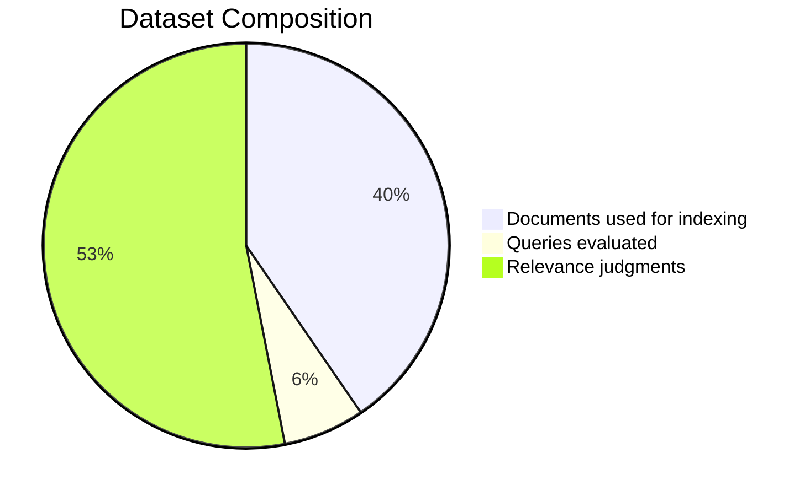

| File | Description | Count |
|------|-------------|------:|
| `cran.all.1400` | Aeronautical research abstracts | `1,400` documents |
| `cran.qry` | Natural language user queries | `225` queries |
| `cran.qrel` | Human relevance judgments | `1,837` pairs |

**Coverage:**
- Queries with judgments: **225 / 225** (100%)
- Unique documents judged: **924 / 1,400** (66%)
- Avg relevant docs per query: **~8.2**
- Documents NOT in qrel → treated as **non-relevant** (Cranfield convention)

---

## 📦 Dependencies

```txt
nltk>=3.8.1          # Tokenization · stopwords · Porter stemmer
numpy>=1.26.0        # Array operations
scipy>=1.12.0        # Sparse CSR matrices
scikit-learn>=1.4.0  # Evaluation utilities
google-genai>=1.0.0  # Gemini API for RAG phase
```

```bash
pip install -r requirements.txt
```

> NLTK data (`stopwords`, `punkt`) is downloaded automatically on first run.

---

## ⚙️ CLI Reference

```bash
python main.py [OPTIONS]

Options:
  --data-dir  DIR       Cranfield data folder       (default: data/)
  --k         INT       Top-k docs for display/RAG  (default: 20)
  --no-rag              Skip Gemini RAG generation
  --rag-queries INT...  Query IDs to run RAG on     (default: 1 2 3 5 10)
  --rag-top-k INT       Docs fed to LLM per query   (default: 5)
  --output    DIR       Output folder               (default: results/)
```

**Common usage patterns:**

```bash
# Run everything
python main.py

# IR evaluation only — no API key needed
python main.py --no-rag

# RAG on 10 specific queries
python main.py --rag-queries 1 3 9 15 25 50 75 100 150 200

# Test individual modules
python phase0_parser.py         # Check dataset parsing
python phase1_preprocessor.py  # Check tokenization/stemming
python phase3_4_tfidf_retrieval.py  # Check retrieval results
python phase5_evaluation.py    # Check MAP/NDCG scores
python phase7_rag.py           # Test RAG on 3 queries
```

---

## 👥 Course Information

| | |
|--|--|
| **Course** | Information Retrieval (AI356) |
| **Academic Year** | Spring 2025-2026 |
| **Institution** | Jordan University of Science and Technology |
| **Instructor** | Dr. Abdullah Al-Amaren |
| **Dataset** | Cranfield Benchmark Collection |
| **Submission Date** | 08/05/2026 |

---

<div align="center">

**Built with Python · Evaluated on Cranfield · Powered by Gemini 2.5 Flash**

*Information Retrieval (AI356) · Spring 2025-2026*

</div>
